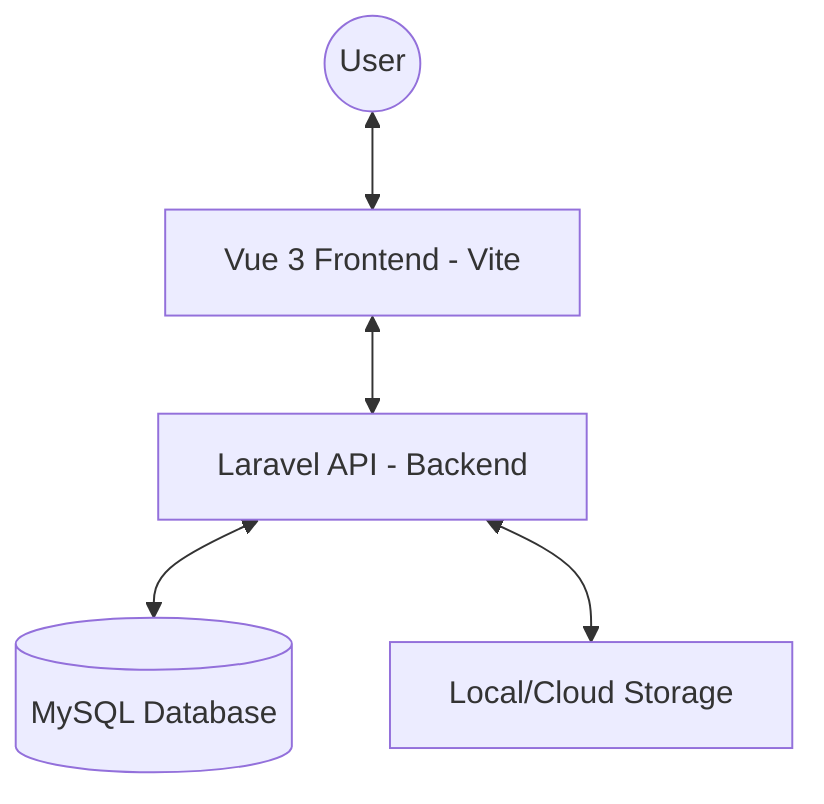

# System Architecture

The Scan Center Management Admin Panel is built using a modern decoupled architecture with Laravel as the backend API engine and Vue 3 as the frontend interface.

## High-Level Architecture

## Backend Architecture (Laravel MVC + Service Layer)

The backend follows the **Service Layer** pattern to keep controllers thin and encapsulate business logic.

- **Controllers:** Handle incoming requests, validate input via FormRequests, and return JSON responses using API Resources.
- **Services:** Contain the core business logic. Controllers delegate tasks to these services (e.g., `OrderService`, `WhatsAppService`).
- **Models:** Eloquent models representing the database schema with relationships and scopes.
- **Middleware:** Handles authentication (Sanctum), role/permission checks (Spatie), and CORS.

## Frontend Architecture (Vue 3 Component-Based)

The frontend is a Single Page Application (SPA) built with **Vue 3** and **Vite**.

- **Components:** Modular, reusable UI elements built with Tailwind CSS.
- **Views:** Page-level components associated with routes.
- **Router:** Vue Router manages client-side navigation and route guards for authentication.
- **Composable Pattern:** Logic is shared using Vue 3 Composables (found in `resources/js/admin/composables`).
- **Layouts:** Shared application shells (e.g., `AdminLayout.vue`).

## API Communication & Flow

1. Frontend sends an HTTP request using **Axios**.
2. Laravel **Sanctum** authenticates the request via a Bearer Token stored in `localStorage`.
3. **Route Guard** in Vue Router checks user permissions before allowing navigation.
4. Laravel Controller validates data.
5. Service handles complex logic (e.g., database transactions, image processing).
6. Success/Error response is returned as JSON.

## Role & Permission Management

Powered by **Spatie Laravel Permission**:
- **Super Admin:** Unrestricted access.
- **Dynamic Roles:** Roles like "Admin", "Manager", etc., are stored in the database.
- **Permissions:** Granular permissions (e.g., `product-list`, `order-edit`) are assigned to roles.
- **Frontend Sync:** User permissions are synced to the frontend on login to dynamically show/hide UI elements.

## Folder Structure Summary

- `app/Http/Controllers/Admin`: Admin-specific API controllers.
- `app/Services`: Business logic implementation.
- `app/Models`: Database logic.
- `resources/js/admin`: Main entry for Vue frontend.
- `resources/js/admin/components`: Reusable UI components.
- `resources/js/admin/views`: Page components related to routes.

---
[Next: Backend Implementation](backend.md)
